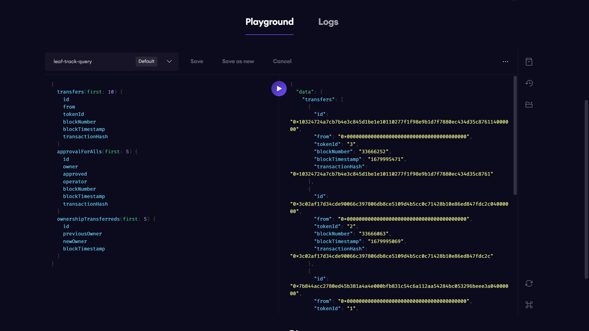

 # [Leaf Track]([https://leaf-track.vercel.app])  

LeafTrack is being developed at Scaling Ethereum 2023.

LeafTrack is a remote sensing service that utilizes free, high-resolution satellite images to monitor the vegetation layer of a given area, such as a nature reserve. The service provides detailed information about the vegetation, including its health, growth, and distribution, through the use of advanced algorithms and machine learning models.

This information is then stored in a blockchain-based system, which ensures its immutability and transparency. The blockchain system also allows for secure and decentralized data sharing among relevant stakeholders, such as researchers and conservationists.

By leveraging this technology, LeafTrack acts as an early warning system for any changes in the vegetation layer, enabling reserve managers to make well-informed decisions in a timely manner. This can include identifying areas that require more attention or intervention, such as those affected by invasive species or climate change.

<h3>Tech Stack: </h3>

<b>The Graph </b> is used in the LeafTrack project to request information and save it in the blockchain-based system, ensuring immutability and transparency of the data.

Link: <a href="https://thegraph.com/hosted-service/subgraph/pradeepvarma22/leaf-track
">https://thegraph.com/hosted-service/subgraph/pradeepvarma22/leaf-track
</a>

<b>Chainlink </b> is used to connect smart contracts with off-chain data and services. In the LeafTrack project, it ensures that the data from satellite images is securely and accurately transferred to the blockchain-based system.

<b>Filecoin</b> is used in the LeafTrack project to save analyzed and compressed satellite images in an IPFS system. This ensures that the images are easily accessible, yet remain secure and decentralized.

<b>OpenZeppelin</b> provides templates for deploying smart contracts for dynamic non-fungible tokens (NFTs). In the LeafTrack project, it helps in the creation and management of the NFTs for each satellite image, allowing them to be uniquely identified and traded.

<b>Polygon</b> is used as a testnet for deploying the LeafTrack project. This allows for testing and fine-tuning of the system before deploying it on the main Ethereum network.

<b>ENS</b> (Ethereum Name Service) is used in the LeafTrack project for decentralized naming of wallets, websites, and other resources, which allows for easier access and better organization of the system.

<h4>Prerequisites:</h4> Node (v16 LTS) and Git

Clone the repository:

git clone https://github.com/F3-Buidlers/Leaf-Track.git
Install dependencies:

npm install
Run the project:

npm start

<h6> Contract Addresses: </h6>
FVM Hyperspace Testnet Contract Address:0x512F7469BcC83089497506b5df64c6E246B39925  
Scroll:  0xb777774C9955b0EbfD84cF1769977ac87ED948De  
Polygon  Testnet Contract Address : 0xb777774C9955b0EbfD84cF1769977ac87ED948De  
Mantle Testnet Contract Address: 0x9fE46736679d2D9a65F0992F2272dE9f3c7fa6e0  

